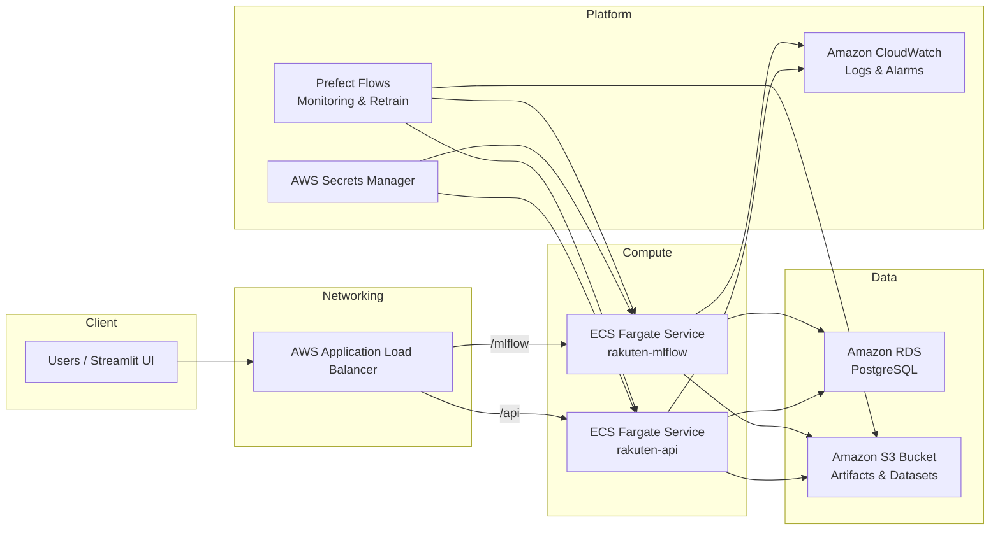

# Rakuten Product Classification — End-to-End MLOps (Nov 2025)

> Local-first experience with a matching AWS Fargate deployment: run everything on your laptop or spin up the managed stack behind an Application Load Balancer.

## What This Pipeline Delivers
- Multi-modal classification (text + image metadata) for Rakuten catalog entries
- Prefect orchestration covering ingestion → feature engineering → training → batch predictions
- Data & model versioning with DVC (remote: Dagshub)
- Experiment tracking and model registry via MLflow + PostgreSQL containers
- FastAPI inference service with Prometheus metrics & Evidently drift analysis
- Grafana dashboards and Streamlit “control room” for day-to-day ops
- CI sanity checks through GitHub Actions (lint, unit tests)

## Architecture at a Glance

```
                               ┌─────────────┐
                               │  data/raw   │
                               └─────┬───────┘
                                     │ ingest (Prefect + DVC)
                                     ▼
┌──────────────┐   features   ┌──────────────┐   train   ┌──────────────┐
│ DVC pipeline │────────────▶│ Prefect Flow │──────────▶│   MLflow     │
└──────┬──────┘              └─────┬────────┘          └────┬─────────┘
       │ artifacts                   │ metrics/models        │ artifacts
       ▼                             ▼                       ▼
┌──────────────┐            ┌──────────────┐        ┌──────────────────┐
│ data/interim │            │ data/processed│       │ models/ & metrics │
└──────────────┘            └──────────────┘        └────────┬─────────┘
                                                              │
                                                              ▼
                                                      ┌──────────────┐
                                                      │ FastAPI API  │
                                                      └────┬─────────┘
                                                           │ requests
                                                           ▼
         ┌──────────────────────┐      metrics      ┌──────────────────┐
         │ inference_log.csv    │◀─────────────────│ Prometheus Export │
         └──────────┬───────────┘                  └────────┬──────────┘
                    │                                    scrape │
                    ▼                                         ▼
              ┌─────────────┐                         ┌────────────────┐
              │ Evidently   │                         │ Grafana        │
              └────┬────────┘                         └──────┬─────────┘
                   │ drift insights                         │ dashboards
                   ▼                                         ▼
             Prefect monitor flow                    Streamlit Ops UI
```

The Streamlit app orchestrates Docker services, Prefect flows, MLflow runs, and monitoring dashboards from a single UI.

### Cloud Deployment (AWS Fargate)



## Deployment Options

- **Local Docker Compose (dev & demos)** — PostgreSQL, MLflow, FastAPI, Prometheus, and Grafana containers on `localhost`.
- **AWS Fargate (cloud-native)** — Separate ECS services for MLflow and the prediction API, fronted by an Application Load Balancer, with RDS + Secrets Manager and S3-backed artifacts. The Streamlit UI can target either environment via environment variables.

### AWS Cloud Stack Overview

| Component | Service | Notes |
|-----------|---------|-------|
| Networking | Application Load Balancer | Routes `/api` and `/mlflow` paths to the respective ECS services |
| Compute | ECS Fargate (`rakuten-api`, `rakuten-mlflow`) | Task definitions in `task-definitions/` |
| Model Registry | MLflow Server on Fargate | Persists metadata to RDS, artifacts to S3 |
| Database | Amazon RDS (PostgreSQL) | Connection details injected via Secrets Manager |
| Storage | Amazon S3 | Houses MLflow artifacts, datasets (`upload_to_s3.sh`) |
| Secrets | AWS Secrets Manager | Stores DB credentials, MLflow configuration, model metadata |
| Observability | CloudWatch Logs | ECS task logs streamed automatically |

The Streamlit `Infrastructure` page (`streamlit_app/pages/2_Infrastructure.py`) interrogates ECS, RDS, and the ALB when `AWS_ALB_URL` is set, giving a control-plane for cloud deployments.

### Cloud Deployment Guide (AWS)

1. **Prepare registries and buckets**
   - Create two ECR repositories: `rakuten-api` and `rakuten-mlflow`.
   - Provision an S3 bucket (example: `mlops-rakuten-seba`) and upload data with `./upload_to_s3.sh`.
2. **Provision databases & secrets**
   - Create an RDS PostgreSQL instance (db.t4g.small works well) and note the host/port.
   - Store credentials + connection info in Secrets Manager as expected by the task definitions (`rakuten/db-config-*`, `rakuten/mlflow-config-*`).
3. **Build & push images**
   ```bash
   docker build -t <acct>.dkr.ecr.<region>.amazonaws.com/rakuten-api:latest -f Dockerfile.api .
   docker build -t <acct>.dkr.ecr.<region>.amazonaws.com/rakuten-mlflow:latest -f Dockerfile.mlflow .
   aws ecr get-login-password --region <region> | docker login --username AWS --password-stdin <acct>.dkr.ecr.<region>.amazonaws.com
   docker push <acct>.dkr.ecr.<region>.amazonaws.com/rakuten-api:latest
   docker push <acct>.dkr.ecr.<region>.amazonaws.com/rakuten-mlflow:latest
   ```
4. **Register task definitions**
   - Apply JSON manifests in `task-definitions/` (`rakuten-api-task.json`, `rakuten-mlflow-task.json`). Adjust ARNs or secrets names as required.
5. **Create ECS services**
   - Place both services in an ECS cluster (default: `rakuten-mlops-cluster`) using Fargate with awsvpc networking.
   - Attach the services to an ALB listener; forward `/api*` to the API target group and `/mlflow*` to the MLflow target group.
6. **Expose endpoints to clients**
   - Export `AWS_ALB_URL`, `API_URL`, and `MLFLOW_URL` for the Streamlit app, or store them in Streamlit Cloud secrets.
   - Run the Streamlit UI locally or on Streamlit Cloud; the Infrastructure page will now display ECS/RDS status and quick links.
7. **Verify the deployment**
   - Run `./verify_deployment.sh` to check for required files.
   - Use `streamlit_app/pages/2_Infrastructure.py` to confirm services are healthy.

💡 **Tip:** When the ALB URL is set (e.g. `https://rakuten-mlops.example.com`), the Streamlit constants automatically switch API/MLflow URLs to `https://.../api` and `https://.../mlflow`.

## Quick Start (Localhost)

1. **Clone & install Python deps** (Python 3.11 is required for Prefect):
   ```bash
   python3.11 -m venv .venv
   source .venv/bin/activate
   pip install -r requirements.txt
   ```
2. **Create `.env`** (copy the template and fill values as needed):
   ```bash
   cp .env.example .env
   nano .env
   ```
   Required keys today:
   - `POSTGRES_USER`, `POSTGRES_PASSWORD`, `POSTGRES_DB`
   - `MLFLOW_TRACKING_URI=http://localhost:5000`
   - `GF_SECURITY_ADMIN_USER`, `GF_SECURITY_ADMIN_PASSWORD`
   - Optional S3 keys if you replicate artifact sync (not required for local runs)
3. **Start core services** (PostgreSQL + MLflow + FastAPI API):
   ```bash
   docker-compose -f docker-compose.api.yml up -d
   # MLflow UI → http://localhost:5000
   # FastAPI docs → http://localhost:8000/docs
   ```
4. **Run the end-to-end Prefect flow**:
   ```bash
   source .venv/bin/activate
   export $(cat .env | grep -v '^#' | xargs)
   python flows/pipeline_flow.py
   ```
5. **Bring up monitoring** (Prometheus + Grafana):
   ```bash
   docker-compose -f docker-compose.monitor.yml up -d
   # Prometheus → http://localhost:9090
   # Grafana → http://localhost:3000 (use credentials from .env)
   ```
6. **Generate drift report (optional but recommended after predictions)**:
   ```bash
   python src/monitoring/generate_evidently.py
   open reports/evidently/evidently_report.html
   ```
7. **Launch the Streamlit control room**:
   ```bash
   pip install -r requirements-streamlit.txt
   streamlit run streamlit_app/Home.py
   ```

## Operational Cheat-Sheet

**Prefect flows**
- `flows/pipeline_flow.py` — orchestrates ingest → preprocess → train → predict.
- `flows/monitor_and_retrain.py` — checks drift (Evidently) and triggers retrain.

**DVC**
- `dvc repro` reproduces the exact pipeline tracked in `dvc.yaml`.
- `dvc push` uploads artifacts to Dagshub when credentials are configured.

**FastAPI service**
- Exposed at `http://localhost:8000` with `/predict`, `/health`, `/metrics` endpoints.
- Loads latest production model from MLflow registry (tagged via Prefect run).

**Monitoring stack**
- Prometheus scrapes FastAPI metrics and custom exporters (local Compose).
- Grafana dashboards pre-provisioned under `monitoring/` configs (local Compose).
- Evidently compares `data/monitoring/inference_log.csv` against reference data; alerts can promote retraining via Prefect.
- In AWS, CloudWatch captures container logs; Prometheus/Grafana remain optional (deploy separately or run locally against the ALB).

**Streamlit app**
- Start/stop Docker services, launch Prefect flows, inspect MLflow runs.
- Useful scripts: `run_streamlit.sh` (local helper).

## Testing & CI
- Quick smoke test: `./quick_test.sh`
- Unit/integration tests: `pytest`
- GitHub Actions runs lint + tests on every push to `Dev` and `master`.

## Troubleshooting (Local Only)
- **Missing `.env` variables** → containers fail to start or MLflow writes locally. Re-run `export $(cat .env ...)` in each shell.
- **Model artifacts not found** → run `python flows/pipeline_flow.py` to refresh model + metrics.
- **Grafana empty panels** → ensure `docker-compose.monitor.yml` is running and Prometheus can reach `http://rakuten_api:8000/metrics` inside the network.
- **Streamlit cannot control Docker** → run the app with privileges to access the local Docker socket.

## Future Work
- Automated blue/green promotions between MLflow `champion` / `challenger` aliases
- Route53 + ACM automation for custom domains & TLS
- Cloud-native observability enhancements (CloudWatch alarms, managed Prometheus/Grafana)
- Event-driven retraining via AWS Step Functions or Prefect Cloud

## License

See `LICENSE` for full terms.

